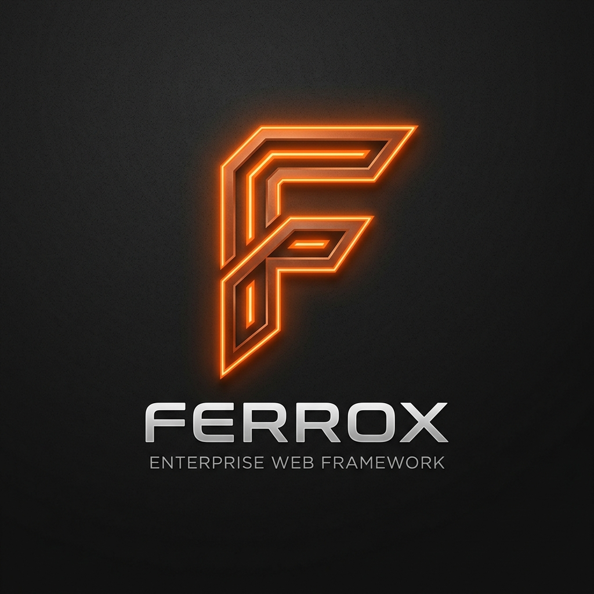

# ⚡ Ferrox Framework

<p align="center">
  
</p>

<p align="center">
  <b>A Progressive, Enterprise-Grade Server-Side Framework for Rust</b><br/>
  <i>Bringing the Developer Experience of NestJS & Angular to the unmatched performance of Tokio & Axum.</i>
</p>

<p align="center">
  <a href="#-philosophy">Philosophy</a> •
  <a href="#-architecture">Architecture</a> •
  <a href="#-crate-workspace-inventory">Crate Inventory</a> •
  <a href="#-quick-start">Quick Start</a> •
  <a href="#-documentation">Documentation</a> •
  <a href="https://discord.gg/Bx3CzGec7d">Discord</a>
</p>

---

## 🎯 Philosophy

In the web development world, frameworks like **NestJS** and **Spring Boot** popularized structured, maintainable, and modular backend architecture based on **Inversion of Control (IoC)** and **Dependency Injection**. However, as systems scale to millions of concurrent requests, single-threaded runtimes or heavy garbage-collected virtual machines face memory bloat, high latencies, and CPU limits.

**Ferrox bridges the gap between rapid Developer Experience (DX) and extreme Rust performance.**

Built on top of [Axum](https://github.com/tokio-rs/axum) and [Tokio](https://tokio.rs/), Ferrox provides an out-of-the-box, opinionated architecture for building production-ready, highly testable, zero-trust microservices and monolithic web applications.

### Key Highlights
- 🛡️ **Zero-Trust Security by Default**: Built-in PASETO JWT translation, role guards, and HMAC webhook verification.
- ⚡ **Cache Stampede Protection**: Integrated `Singleflight` pattern powered by Tokio broadcast channels.
- 🔄 **Resilience & Fault Tolerance**: Rate limiters, circuit breakers, and distributed synchronizers out of the box.
- 🧠 **Enterprise Patterns**: CQRS Command/Query buses, Saga orchestrators, and Event Emitters.
- 🛠️ **Code Factory & AutoZod**: Automated generic CRUD routing and strongly-typed payload validation.

---

## 🏗️ Architecture

Ferrox enforces an **Onion Request Pipeline**. Requests pass through non-blocking, early-failing security, rate-limiting, and validation layers before ever touching business logic or database pools.

```
       +---------------------------------------------------------+
       |                   Incoming HTTP Stream                  |
       +---------------------------------------------------------+
                                    |
                                    v
       +---------------------------------------------------------+
       |   1. Global Middleware (Logging, Tracing, CORS)         |
       +---------------------------------------------------------+
                                    |
                                    v
       +---------------------------------------------------------+
       |   2. Rate Limiter & Circuit Breaker (Redis / In-Mem)     |
       +---------------------------------------------------------+
                                    |
                                    v
       +---------------------------------------------------------+
       |   3. Auth Guards (PASETO / JWT Claims Extraction)         |
       +---------------------------------------------------------+
                                    |
                                    v
       +---------------------------------------------------------+
       |   4. Validation Pipe (AutoZod / ValidatedJson<T>)        |
       +---------------------------------------------------------+
                                    |
                                    v
       +---------------------------------------------------------+
       |   5. Controller Route Handler                            |
       +---------------------------------------------------------+
                                    |
                                    v
       +---------------------------------------------------------+
       |   6. Fat Provider / Service (CQRS / Saga Orchestrator)   |
       +---------------------------------------------------------+
                                    |
                                    v
       +---------------------------------------------------------+
       |   7. Data Persistence (SeaORM / Mongo / Redis Pool)     |
       +---------------------------------------------------------+
```

---

## 📦 Crate Workspace Inventory

Ferrox is structured as a modular workspace containing 35+ specialized crates:

| Crate Category | Crate Name | Description |
|---|---|---|
| **Core Application** | `ferrox-app` | Multi-transport lifecycle manager & graceful shutdown orchestrator |
| | `ferrox-errors` | Centralized `AppError`, `ErrorResponse`, and Axum `IntoResponse` |
| | `ferrox-config` | Typed configuration loader (`.env`, `.toml`) with `secrecy` integration |
| | `ferrox-types` | Standardized domain types, wrapper IDs, and `Pagination` helpers |
| | `ferrox-utils` | Common utilities and helper algorithms |
| **Abstractions & DX** | `ferrox-validation` | `ValidatedJson<T>` extractor with automated `validator` checks |
| | `ferrox-guards` | Declarative role-based access control (`RequireRole`) extractors |
| | `ferrox-interceptors` | Request/response execution lifecycle interceptors & `CacheInterceptor` |
| | `ferrox-crud-gen` | Macros (`crud_router!`, `vertical_slice!`) for zero-boilerplate CRUD |
| **Databases** | `ferrox-database-core` | Base `Repository<Entity, Id>` trait abstraction |
| | `ferrox-database-seaorm` | Relational database driver (Postgres, MySQL, SQLite via SeaORM) |
| | `ferrox-database-mongo` | Document database driver and BSON helpers |
| | `ferrox-database-redis` | In-memory key-value cache, connection pool, and pub/sub |
| | `ferrox-migrations` | Automatic database schema migration runner |
| **Resilience & Security**| `ferrox-security` | PASETO/JWT token engine, dual-token refresh, `PublicId` |
| | `ferrox-singleflight` | Cache stampede (dogpile effect) prevention using broadcast channels |
| | `ferrox-circuit-breaker` | Circuit breaker pattern (Closed, Open, HalfOpen state machine) |
| | `ferrox-rate-limiter` | Redis-backed fixed window / token bucket rate limiter |
| | `ferrox-sync` | Distributed locking and synchronization mechanisms |
| **Architectures** | `ferrox-cqrs` | Decoupled `CommandBus` and `QueryBus` dispatchers |
| | `ferrox-saga` | Saga orchestrator engine for distributed multi-step transactions |
| | `ferrox-events` | `DomainEvent` dispatcher and `InMemoryDispatcher` broadcast bus |
| | `ferrox-jobs` | Apalis & Redis-backed background worker queue engine |
| | `ferrox-schedule` | Cron job scheduler for background task execution |
| **Observability** | `ferrox-logger` | Structured JSON logging subscriber and Sentry integration |
| | `ferrox-health` | Kubernetes `/healthz` (liveness) and `/readyz` (readiness) probes |
| | `ferrox-metrics` | Prometheus metrics exporter and counter metrics |
| | `ferrox-tracing` | OpenTelemetry distributed tracing and correlation ID handling |
| **Transports** | `ferrox-transports` | Multi-transport interfaces (HTTP, gRPC, WebSockets, FTP) |
| | `ferrox-graphql` | GraphQL integration with `async-graphql` schema builders & SDL export |
| | `ferrox-sse` | Server-Sent Events (SSE) push stream builders |
| | `ferrox-storage` | Local disk and S3/MinIO cloud storage abstraction |
| | `ferrox-datagrid` | AG-Grid, MUI X, and TanStack Table query parameter translators |
| **Integrations** | `ferrox-mailer` | Lettre SMTP email dispatcher (SendGrid, AWS SES) |
| | `ferrox-notifications-slack` | Slack webhook alert dispatchers |
| | `ferrox-payments-stripe` | Stripe Checkout & Webhook verification |
| | `ferrox-payments-google` | Google Pay and in-app purchase validation |
| | `ferrox-feature-flags` | Feature toggle evaluation engine |
| | `ferrox-webhooks` | Outgoing webhook dispatcher with HMAC signing & backoff retry |
| | `ferrox-reports` | PDF & CSV report generation helpers |
| | `ferrox-cloud-helpers` | Cloud SDK utilities (AWS/GCP/Azure) |
| | `ferrox-i18n` | Multi-language translation & locale extraction |
| **Tooling** | `ferrox-cli` | Command Line Interface (`ferrox init`, `ferrox generate --lang ts`) |

---

## 🚀 Quick Start

### 1. Add Ferrox Dependencies
Add the required Ferrox crates to your `Cargo.toml`:

```toml
[dependencies]
ferrox-app = { path = "crates/ferrox-app" }
ferrox-transports = { path = "crates/ferrox-transports" }
ferrox-logger = { path = "crates/ferrox-logger" }
ferrox-errors = { path = "crates/ferrox-errors" }
axum = "0.7"
tokio = { version = "1", features = ["full"] }
```

### 2. Create Your Application (`src/main.rs`)

```rust
use axum::{routing::get, Json, Router};
use ferrox_app::FerroxApp;
use ferrox_logger::{setup_logger, LoggerConfig};
use ferrox_transports::http::HttpTransport;
use serde_json::json;

#[tokio::main]
async fn main() -> Result<(), Box<dyn std::error::Error>> {
    // 1. Initialize Logger
    let _sentry = setup_logger(LoggerConfig::default())?;

    // 2. Build Router
    let router = Router::new().route(
        "/api/v1/ping",
        get(|| async { Json(json!({ "status": "ok", "framework": "Ferrox" })) }),
    );

    // 3. Configure HTTP Transport
    let transport = HttpTransport::new(router, 3000)
        .with_strict_cors(vec!["http://localhost:3000"]);

    // 4. Start Ferrox Multi-Transport App
    FerroxApp::new()
        .add_transport(transport)
        .start()
        .await?;

    Ok(())
}
```

---

## 📚 Documentation

The full documentation website is built with Docusaurus and located in the [`docs/`](docs/) directory.

To run the documentation portal locally:

```bash
cd docs
npm install
npm run start
```

Visit `http://localhost:3000` to browse the interactive documentation.

## 💬 Community & Support

Join the official global **Ferrox Discord Community Server** to discuss framework architecture, ask questions, share showcases, and collaborate with developers worldwide:

[](https://discord.gg/Bx3CzGec7d)

- **Discord Invite Link:** [https://discord.gg/Bx3CzGec7d](https://discord.gg/Bx3CzGec7d)

---

## 📜 License

Ferrox is dual-licensed under either of the following licenses at your option:

- **[MIT License](LICENSE-MIT)**
- **[Apache License, Version 2.0](LICENSE-APACHE)**

Unless you explicitly state otherwise, any contribution intentionally submitted for inclusion in Ferrox by you shall be dual-licensed as above, without any additional terms or conditions.
