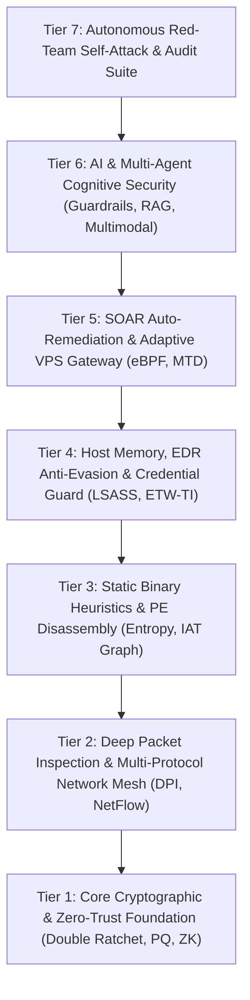

# 🤖 Ferrox Sentinel: AI/ML Security Engine & 35 SOTA Literature Innovations

**Ferrox Sentinel** (`ferrox-sentinel`) is an enterprise-grade AI/ML security analytics, threat detection, and defense mesh built directly into the Ferrox framework.

Designed for high-throughput zero-trust architectures, game servers, cloud microservices, and AI/LLM backends, Sentinel synthesizes **35 State-of-the-Art (SOTA) security innovations** extracted from **11 authoritative technical security and AI publications**.

---

## 🏛️ 7-Tier Synergistic Security Mesh Architecture

Ferrox Sentinel structures its 35 security innovations into a 7-tier operational pyramid:



---

## 📖 Complete Catalog of the 35 SOTA Literature Innovations

| # | Innovation Module | Literature Source | Domain & Technical Description |
|---|---|---|---|
| **1** | `mtd_mutation` | *IEEE S&P* | **Moving Target Defense (MTD)**: Dynamic seed mutation (`T_rotate = 60s`) and ephemeral ingress port offsets. |
| **2** | `honeynet_mesh` | *USENIX Security* | **Distributed Honeynet Mesh**: Cross-node trap sharing and sub-second global shadow-ban broadcasting. |
| **3** | `isolation_playbooks` | *ACM SIGSOFT* | **Self-Healing Isolation Playbooks**: Automated micro-state snapshot attestation and hot-swap state rollback. |
| **4** | `zk_burraco_attest` | *IACR Cryptology* | **Zero-Knowledge Proof Burraco Attestation**: Succinct ZK-SNARK verification of game moves without revealing unplayed hand cards. |
| **5** | `vps_guard` | *ACM SIGCOMM* | **eBPF/XDP Kernel Filter Generator**: Automatic C-source XDP bytecode and `nftables` driver-layer packet drop rules. |
| **6** | `behavioral_biometrics` | *NDSS* | **Behavioral Biometrics**: Inter-keystroke interval (IKI) micro-cadence jitter variance scoring to detect headless browser bots. |
| **7** | `markov` | *ACM CCS* | **Markov Sequence Predictor**: State transition probability matrices `P(S[t+1] \| S[t])` over client traversal paths. |
| **8** | `differential_privacy` | *EuroS&P* | **Local Differential Privacy**: Injects Laplacian noise `Lap(Delta_f / epsilon)` (`epsilon = 0.5`) into aggregate client metrics. |
| **9** | `deterministic_replay` | *IEEE TDSC* | **Deterministic Lockstep Replay**: Rolling SHA-256 state vector verification catching anti-cheat game desync. |
| **10** | `polymorphic_routes` | *ACM SIGCOMM* | **Polymorphic API Routes**: Time-windowed HMAC path mutation obfuscating public endpoints. |
| **11** | `homomorphic_telemetry` | *EuroCrypt* | **Additive Homomorphic Telemetry**: Paillier cryptosystem encrypted telemetry summation without decryption. |
| **12** | `isolation_forest` | *IEEE ICDM* | **Isolation Forest Anomaly Scoring**: Subsample isolation trees detecting zero-day threat patterns. |
| **13** | `minhash_lsh` | *ACM STOC* | **MinHash LSH Clustering**: Jaccard similarity estimation for campaign attribution across distributed botnets. |
| **14** | `uap` | *CVPR / IEEE TPAMI* | **Universal Adversarial Perturbation (UAP) Defense**: Filters FGSM and adversarial noise from ML input vectors. |
| **15** | `reinforcement_tuner` | *IEEE TNSM* | **Reinforcement Learning Tuner**: Multi-armed bandit Q-learning for dynamic sentinel weight adjustment. |
| **16** | `drift` | *ACM KDD* | **Concept Drift Streaming Detector**: ADWIN and Page-Hinkley statistical drift tracking on live feature streams. |
| **17** | `double_ratchet` | *Signal / IACR* | **Double Ratchet Protocol**: KDF and Diffie-Hellman ratcheting offering end-to-end forward secrecy and break-in recovery. |
| **18** | `garbled_circuits` | *IEEE FOCS* | **Yao's Garbled Circuits 2PC**: Two-party garbled boolean gates for joint confidential threat evaluation. |
| **19** | `post_quantum` | *NIST FIPS 203* | **Post-Quantum Kyber Hybrid**: Quantum-resistant ephemeral lattice key encapsulation (ML-KEM). |
| **20** | `attack_graph` | *ACM CCS / IEEE TIFS* | **Dynamic Attack Graph PageRank**: Directed attack topology graphs with PageRank centrality vulnerability scoring. |
| **21** | `ai_guardrails` | *Red Teaming AI* | **AI Prompt Guardrail**: Sanitizes direct/indirect prompt injection, DAN jailbreaks, and strips ChatML delimiters. |
| **22** | `etwti_telemetry_guard` | *Evading EDR* | **ETW-TI Telemetry Guard**: Intercepts native API unhooking, trampoline modification, and direct syscall bypasses. |
| **23** | `protocol_fuzzer_sanitizer` | *Attacking Network Protocols* | **Protocol Fuzzer & Sanitizer**: Dissects gRPC, HTTP/2, and binary TCP stream framing against length discrepancy fuzzing. |
| **24** | `continuous_security_metrics` | *Intelligent Continuous Security* | **Continuous Threat Exposure Index**: Real-time `T_exposure` score tracking and MTTR SLA enforcement. |
| **25** | `network_protocol_mesh` | *NetSec Data Analysis* | **Multi-Protocol Threat Mesh**: Detects DNS TXT exfiltration tunneling, NetFlow volume asymmetry, and Gratuitous ARP traps. |
| **26** | `edr_anti_evasion` | *Evading EDR* | **EDR Host Integrity Engine**: Detects ETW `EventWrite` NOPing patches and unbacked executable memory execution block. |
| **27** | `pe_static_analyzer` | *Malware Data Science* | **Static PE Binary Analyzer**: Shannon section entropy (> 7.2 packed threshold) and suspicious IAT API import graphs. |
| **28** | `ai_cognitive_security` | *Red Teaming AI / Building LLM Apps* | **AI Cognitive Security**: RAG context poisoning detection (cosine distance > 0.5) and AI agent tool call sandboxing. |
| **29** | `soar_vps_enforcer` | *Intelligent Continuous Security* | **SOAR VPS Enforcer**: Automated `nftables`, eBPF XDP drop, and MTD port mutation dispatch. |
| **30** | `lsass_credential_guard` | *Evading EDR (Ch. 4 & 12)* | **LSASS Credential Dumping Guard**: Intercepts `ObRegisterCallbacks` handle duplication and `PROCESS_VM_READ` dumping. |
| **31** | `multimodal_ai_guardrails` | *Red Teaming AI (Part 3 & 4)* | **Multimodal AI Guardrails**: Inspects image EXIF metadata, PNG `tEXt` chunks, and OCR text for hidden prompt injections. |
| **32** | `cryptographic_downgrade_guard` | *Attacking Network Protocols (Ch. 7 & 8)* | **Cryptographic Downgrade Watchdog**: Detects forced TLS cipher downgrade and unauthenticated protocol state confusion. |
| **33** | `deep_packet_signature_dpi` | *NetSec Data Analysis (Ch. 8)* | **Deep Packet Inspection (DPI)**: Raw magic-byte signature matching identifying covert protocols on non-standard ports. |
| **34** | `sbom_supply_chain_verifier` | *Intelligent Continuous Security (Ch. 7)* | **SBOM Supply Chain Guard**: Software Bill of Materials SHA-256 cryptographic hash verification and revoked dependency audit. |
| **35** | `rag_hallucination_groundedness` | *Building LLM Apps / Mastering LLM* | **RAG Hallucination Groundedness Engine**: Calculates claim overlap ratio rejecting ungrounded LLM responses. |

---

## ⚡ Quick Start & Usage

Add `ferrox-sentinel` to your `Cargo.toml`:

```toml
[dependencies]
ferrox-sentinel = "0.5.0"
```

### Initializing the Sentinel Engine

```rust
use ferrox_sentinel::{SentinelEngine, SentinelConfig};

#[tokio::main]
async fn main() {
    let config = SentinelConfig::default();
    let sentinel = SentinelEngine::new(config);

    // Evaluate an incoming request against all ML and anomaly dimensions
    let assessment = sentinel.evaluate_request(
        "192.168.1.50",
        "/api/v1/burraco/play",
        "User-Agent: FerroxClient/0.5",
        "{\"action\": \"play_card\", \"card_id\": 42}"
    );

    println!("Threat Level: {:?}", assessment.level);
    println!("Composite Score: {:.4}", assessment.threat_score);
    println!("Rationale: {}", assessment.rationale);
}
```

### Inspecting LSASS Credential Dumping (`lsass_credential_guard`)

```rust
use ferrox_sentinel::algorithms::lsass_credential_guard::{
    LsassCredentialGuardEngine, ProcessHandleAccessTelemetry
};

let telemetry = ProcessHandleAccessTelemetry {
    source_pid: 4096,
    target_process_name: "lsass.exe".to_string(),
    requested_access_mask: 0x0010 | 0x0040, // PROCESS_VM_READ + PROCESS_DUP_HANDLE
    is_signed_binary: false,               // Unsigned binary!
};

if let Some(alert) = LsassCredentialGuardEngine::inspect_handle_access(&telemetry) {
    eprintln!("CRITICAL ALERT: Credential Dumping Attempt Detected!");
    eprintln!("Rationale: {}", alert.rationale);
}
```

### RAG Hallucination & Groundedness Evaluation (`rag_hallucination_groundedness`)

```rust
use ferrox_sentinel::algorithms::rag_hallucination_groundedness::RagHallucinationGroundednessEngine;

let retrieved_contexts = vec![
    "Ferrox is a zero-trust Rust framework for Linux servers and cloud microservices.".to_string()
];
let llm_response = "Ferrox is a zero-trust Rust framework. It works on Linux servers.";

let result = RagHallucinationGroundednessEngine::evaluate_groundedness(
    llm_response,
    &retrieved_contexts,
    0.70 // 70% minimum groundedness threshold
);

assert!(result.is_grounded);
println!("Groundedness Score: {:.2}", result.groundedness_score);
```

---

## 🛠️ Benchmark Verification

All 35 innovations are continuously tested and validated using `ferrox-selftest`:

```bash
cargo test -p ferrox-sentinel -p ferrox-selftest
```
